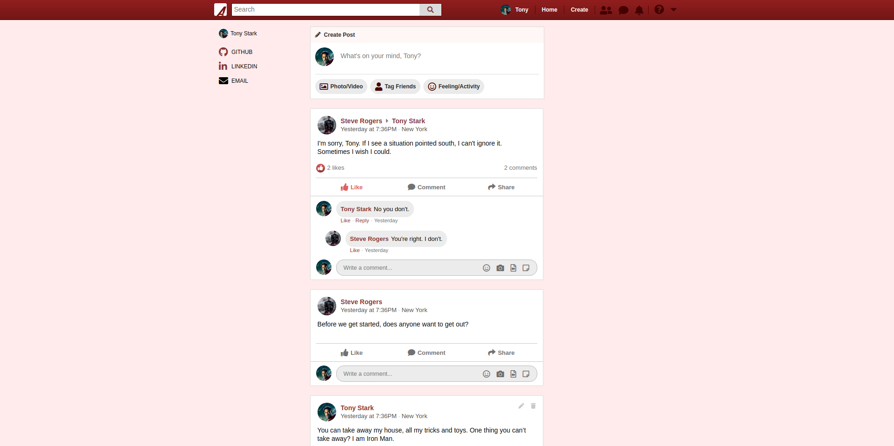

# AssembledFaces

[](http://assembled-faces.herokuapp.com)

[AssembledFaces](http://assembled-faces.herokuapp.com) is a Marvel-themed clone of Facebook, a multimedia social-networking platform, where users can share information between other users through established relationships called "friends." 

## Technologies
* Ruby on Rails
* Postgres
* HTML / CSS
* Javascript
* React
* Redux
* Amazon Web Services S3
* Heroku

## Features

AssembledFaces has many features, all of which you can explore by clicking the Demo Login button on the [splash page](http://assembled-faces.herokuapp.com). 

### Signup Validation

AssembledFaces has a very thorough sign up form authentication system, alerting the user to exactly which fields still needed attention. 
While this may seem like a small part of the experience, directingthe user to the correct fields makes for a very smooth signup process. 


There are multiple layers of form validation taking place:
1. Fields that the user has not had a chance to interact with do not have any alert, allowing the user to fill out the form first without
being bothered. If the user has interacted with the field, but they are invalid, the alerts start appearing. 
2. Invalid fields that are currently selected will not have the red icon, but rather have a helpful message helping the user determine what information
needs to be provided. 
2. Invalid fields that are not curently selected by the user do have the red icon, alerting the user that these fields will need their attention after
they are finished with their current field. 
3. Should the user decide to try signing up without filling out the necessary information, the form will reject the attempt, and alert the user
of all the fields that need their attention. 


### Newsfeed

The landing page upon a successful signup or login is the newsfeed page. Here, the users is greeted with all the posts made by the user and by the users's friends. 



Just to display the correct posts on this user's newsfeed required a number of models (users, posts, friendships) to work together in harmony. In order to filter the posts from the database to be displayed, a custom Rails route needed to be designed apart from the RESTful routes, as a normal GET request could not get me to the correct action as easily. 

```post '/api/posts/:id', to: 'api/posts#feed', defaults: {format: :json}```

This would direct the request to a custom posts controller action ( a custom `#feed` action) that handles the database querying specifically for the news feed. This query looks for posts that fulfill any of these three conditions:
1. The current user is the author.
2. The current user is the user that received the post.
3. The current user is neither the author nor the user, but both the author and the user of the post are friends of the current user.

```
@posts = Post.where("
                    user_id= #{params[:id]} OR author_id = #{params[:id]}
                    OR (
                        user_id in (
                            SELECT 
                                friendships.requested_id
                            FROM 
                                users 
                            JOIN 
                                friendships on users.id = friendships.requester_id
                            WHERE 
                                users.id = #{params[:id]} AND friendships.status = 'accepted'
                            UNION
                            SELECT 
                                friendships.requester_id
                            FROM 
                                users 
                            JOIN 
                                friendships on users.id = friendships.requested_id 
                            WHERE 
                                users.id = #{params[:id]} AND friendships.status = 'accepted')
                        AND 
                        author_id in (
                            SELECT 
                                friendships.requested_id
                            FROM 
                                users 
                            JOIN 
                                friendships on users.id = friendships.requester_id
                            WHERE 
                                users.id = #{params[:id]} AND friendships.status = 'accepted'
                            UNION
                            SELECT 
                                friendships.requester_id
                            FROM 
                                users 
                            JOIN 
                                friendships on users.id = friendships.requested_id 
                            WHERE 
                                users.id = #{params[:id]} AND friendships.status = 'accepted')
                        )
    ")
```

### Profile


The profile page layout is generic across all users, but the information displayed in its various components are unique to each user. Profiles display the user's public information, including, but limited to, their profile picture, cover picture, other photos, friends, workplace, education, and posts. The most intricate part of this page, as well as on the newsfeed page, is the post itself. Posts incorporate all of the models that exist in the database all at once: users, posts, friends, comments, likes. 


From the top of the post:
1. The post header displays the name and profile picture of the author, as well as the user to whom the post was directed, but only if that user is not that author themselves. Following that, the date and time of the post creation is indicated. 
2. The body of the post follows the post header. This can be in the form of text only, picture only, or both. 
3. Underneath the body of the post is the post response section. Only users who are friends of the author can see this section. Friends can choose to interact with this post in a number of different ways. They can like this post using the like button or comment on the post itself further down. They can even reply to a comment with another comment. 

Likes posed an interesting problem because in the Rails backend, they are a polymorphic association. Because comments can also be liked by users (to be implemented), comments and likes can potentially be confused. In order to give the correct likes down to the post, multiple stages of filtering were implemented. 
1. The first step is to fetch all the likes associated with the list of posts to be rendered.
2. Before each post receives information on likes, it is filtered to be specific to that post:
```
likes.filter(like => {
    return like.likeable_id === post.id && like.likeable_type === "Post"
})
```
3. After each post has received the proper likes, further filtering was needed to isolate the singular like that was associated with the current user and this post, which dictated the look and behavior of the like button. If the user has not liked this post, the like button should look unselected and pressing the button should generate a like. The opposite is true in the reverse scenario. 
```
currentUserLike = likes.filter(like => like.user_id === this.props.currentUserId)
```
## Future Implementation
* Comment Likes
* Friend Request Page
* Photos Page
* Sharing posts
* Searching posts
* Saved search results
* Notifications
* Groups and Organization Pages
* Photo Albums